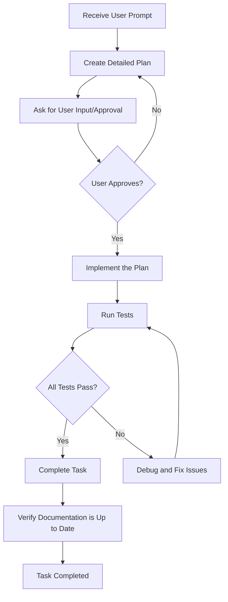

# Copilot Instructions for Discord Package Development

## Development Workflow

Follow this workflow for all development tasks:

## Workflow Steps

1. **Create a Plan from Prompt**: When receiving a user request, first create a comprehensive plan that outlines all the steps needed to accomplish the task.

2. **Ask for User Input**: Present the plan to the user and ask for their approval or feedback before proceeding with implementation.

3. **Implement the Plan**: Once approved, implement the plan step by step, making minimal and focused changes.

4. **Make Sure All Tests Pass**: After implementation, run the test suite to ensure all tests pass and no existing functionality is broken.

5. **Verify Documentation**: Use the docs verification sub-agent to ensure documentation is current and accurate.

## Project Structure

- `src/discord/`: Main Python module source code
- `tests/`: Test files for the discord module
- `docs/`: Documentation files
- `.github/`: GitHub configuration and agent instructions

## Development Guidelines

- Make minimal, surgical changes
- Write tests for new functionality
- Keep documentation up to date
- Follow Python best practices
- Use type hints where appropriate
